# 🚀 CI/CD Pipeline for Maven Java App on AWS

## 📌 Overview

This project demonstrates a complete **CI/CD pipeline** built on AWS for a **Java Maven application** using **Corretto 8**. The process automates building, packaging, and deploying the app from a developer EC2 instance to a production EC2 instance, with infrastructure managed via **CloudFormation (IaC)**.

---

## 🧱 Architecture Summary

### 🔧 Dev Tools & Services
- **Java 8 (Corretto)**, **Maven**
- **Git**, **GitHub PAT for push access**

### ☁️ AWS Services Used
- **EC2 (Dev & Prod)**: Dev for setup and build; Prod for deployment (ARM template)
- **IAM**: Roles for EC2 and CodeArtifact
- **CodeArtifact**: Maven repository
- **S3**: Stores built artifacts
- **CodeBuild**: Builds and pushes artifact to S3
- **CodeDeploy**: Deploys app to Prod EC2
- **CloudFormation**: Scans and defines infra as IaC

---

## 🔄 Pipeline Flow

1. ✅ Launch EC2 Dev instance
   - SSH access, install Git, Java 8 Corretto, and Maven
   - Clone project, modify `index.jsp`, initialize GitHub connection (via PAT)
   - Push code to GitHub

2. 📦 Configure CodeArtifact
   - Setup Maven settings
   - Build project and push to CodeArtifact/S3

3. 🏗️ Setup Production Environment
   - Use ARM template to provision EC2 Prod + networking (VPC, subnets, security groups)
   - Assign IAM role for deployment

4. ⚙️ Configure CI/CD
   - **CodeBuild**: Pulls from GitHub, builds, uploads to S3
   - **CodeDeploy**: Deploys to Prod EC2 on trigger

5. 📜 Infrastructure as Code
   - Scan with CloudFormation to generate a full template of the architecture

---

## 🗂️ Project Highlights

| Stage       | Tool / Service             |
|-------------|----------------------------|
| Development | EC2 (Dev), GitHub, Maven, Java |
| Build       | CodeArtifact, CodeBuild, S3 |
| Deploy      | EC2 (Prod), CodeDeploy     |
| IaC         | CloudFormation (generated) |

---

## 🧪 Result

After pushing to GitHub, the pipeline:
- Automatically builds the project
- Stores the artifact in S3
- Triggers CodeDeploy to update the Prod EC2
- Final result: `index.jsp` shows _"Welcome to the CI/CD test application"_ on the deployed app

---

## 🖼️ Screenshots

### 🔹 EC2 Dev Instance
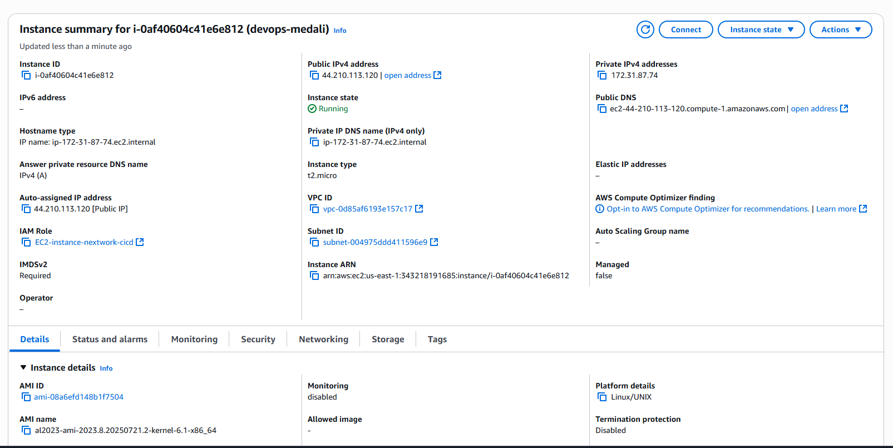

---

### 🔹 SSH into EC2
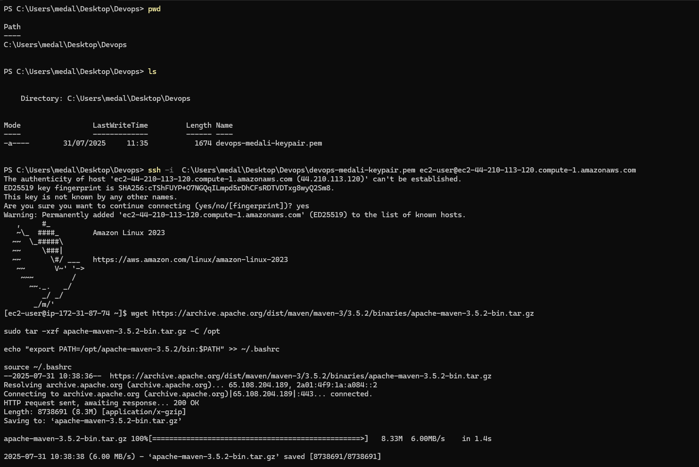

---

### 🔹 Installing Maven and Java

---

### 🔹 Maven and Java installed
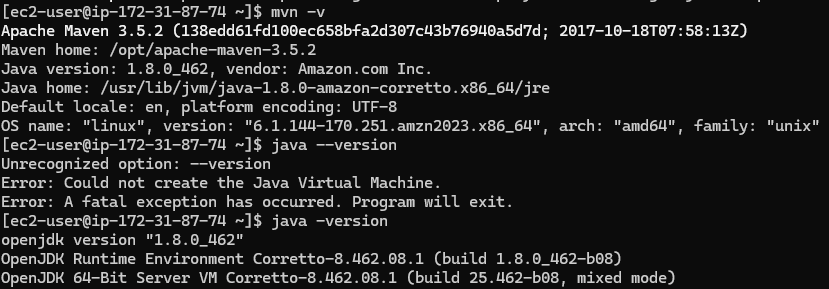

---

### 🔹 Generating Maven Project
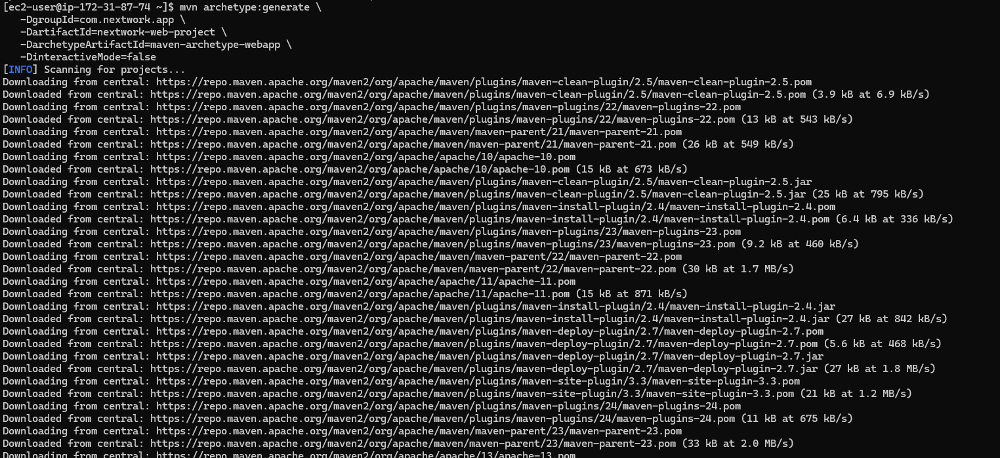

---

### 🔹 Maven Build Success
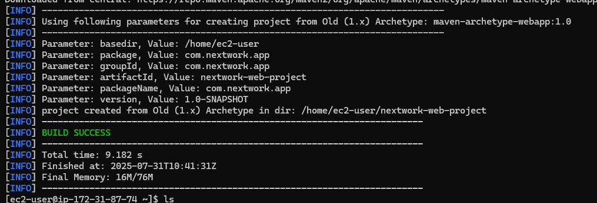

---

### 🔹 Installing Git
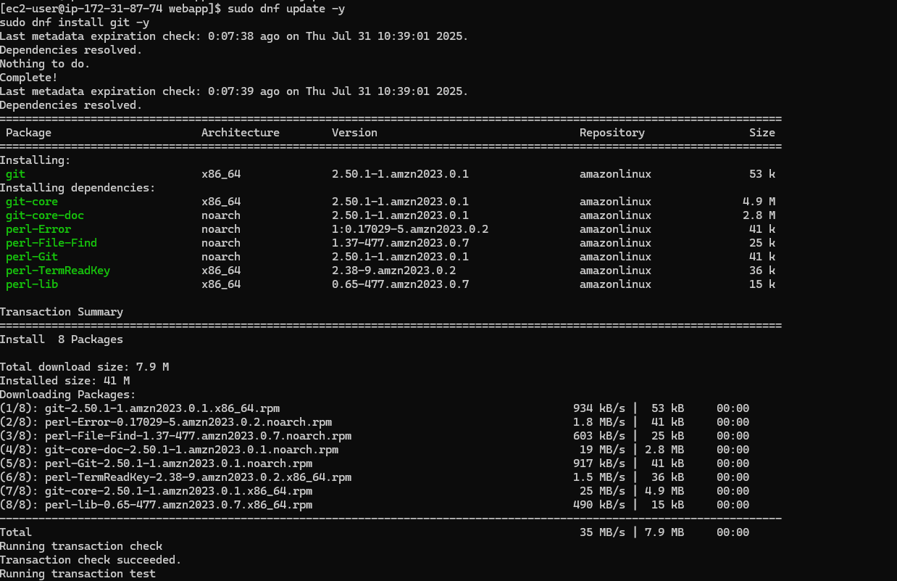

---

### 🔹 GitHub repo
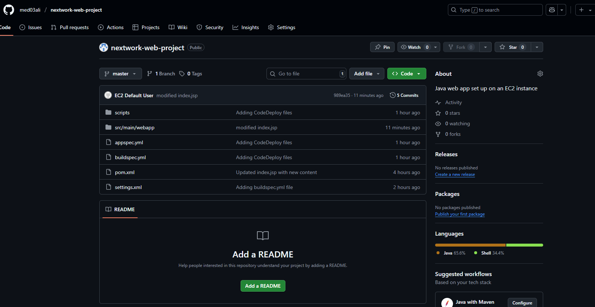

---

### 🔹 First Git Push
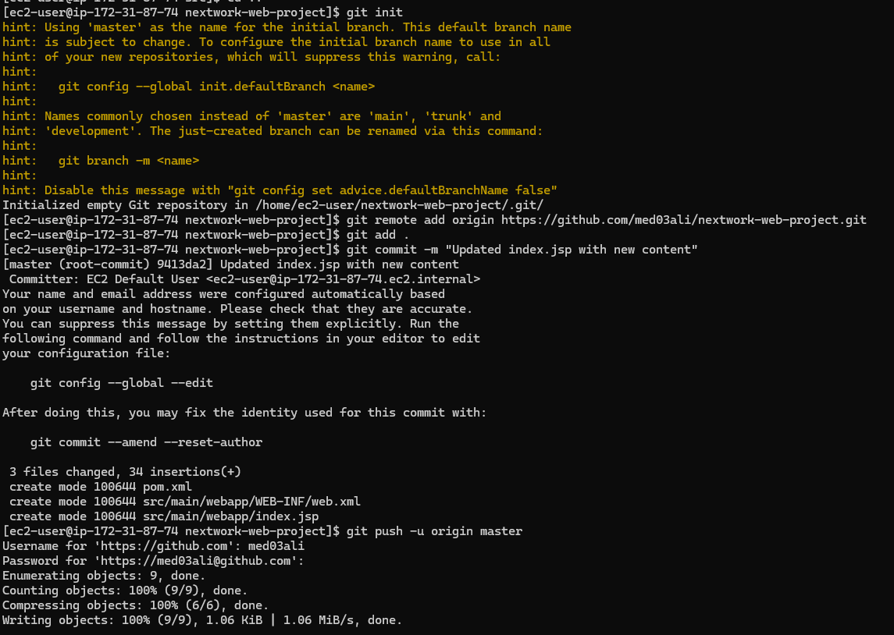

---

### 🔹 CodeArtifact
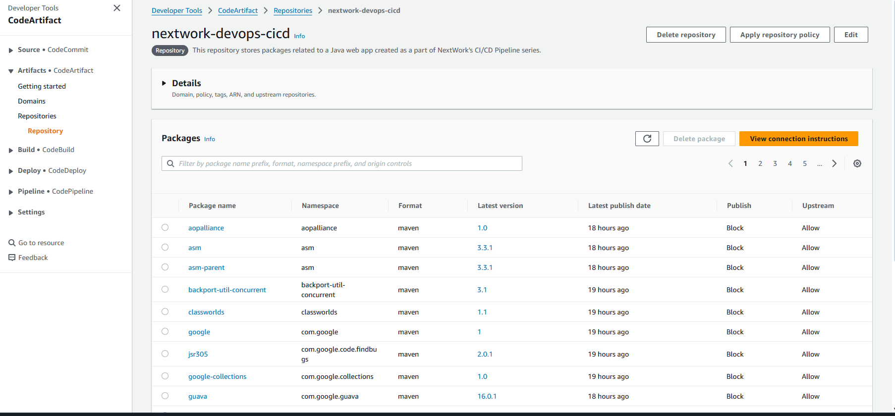

---

### 🔹 EC2 Connected to CodeArtifact - Project Building
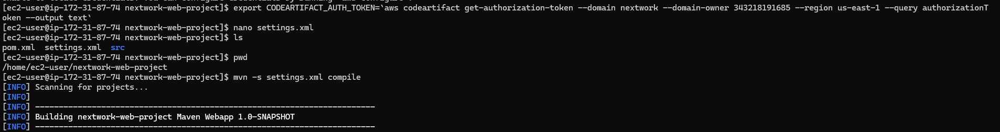

---

### 🔹 Artifact Stored in S3
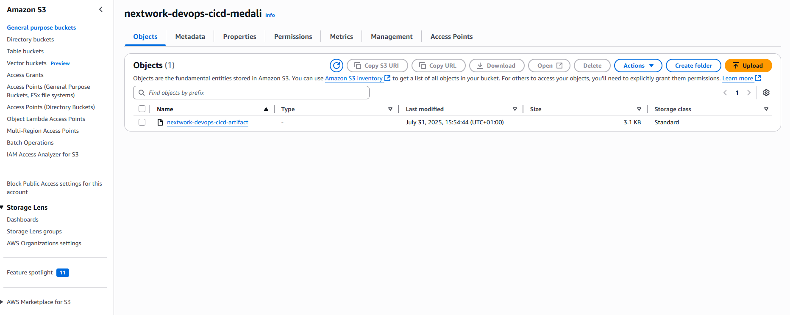

---

### 🔹 Prod EC2 Instance
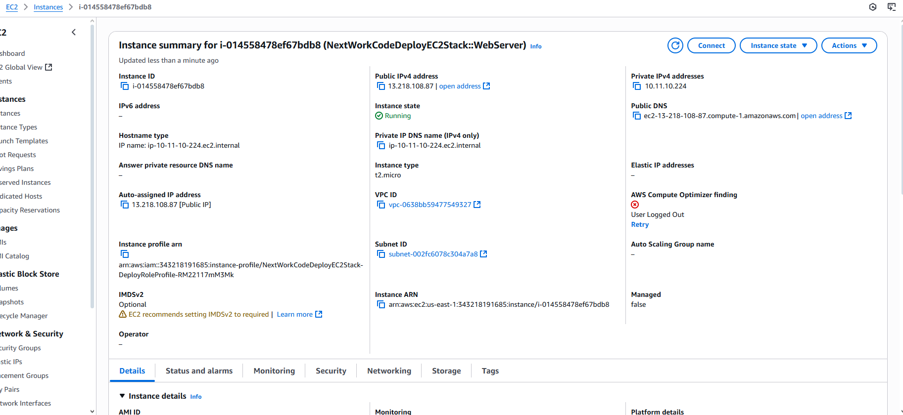

---

### 🔹 CodeBuild Build Succeeded
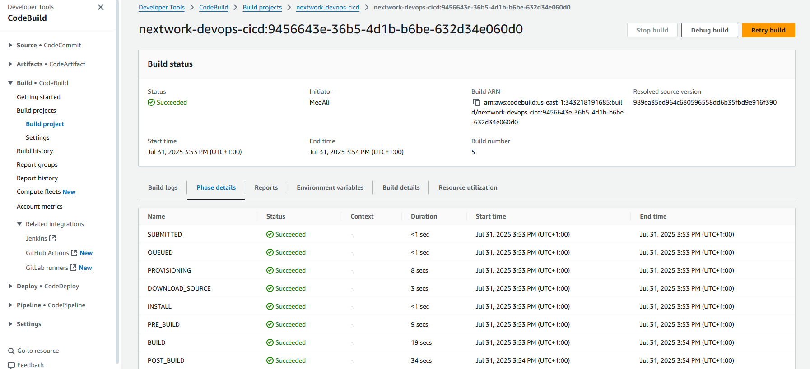

---

### 🔹 CodeDeploy Deployment Succeeded
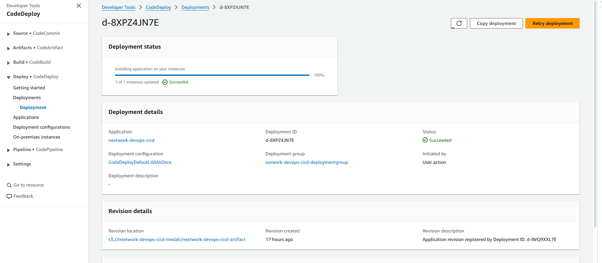

---

### 🔹 App Demo
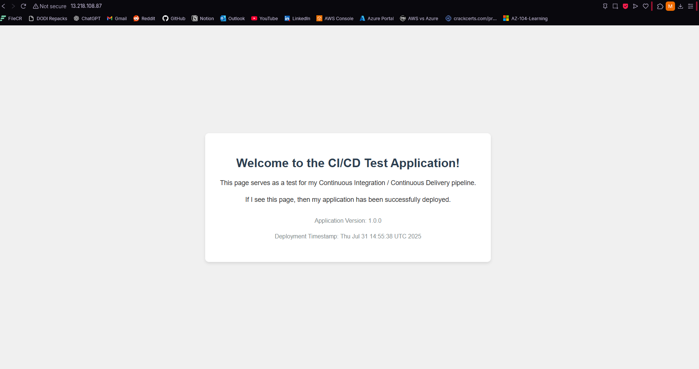

---

### 🔹 IAM Roles
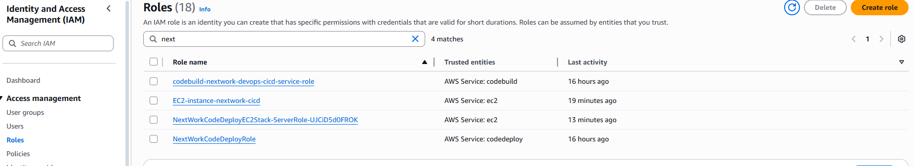

---

### 🔹 Role Exemple

---

### 🔹 CloudFormation Template Generation . IaC
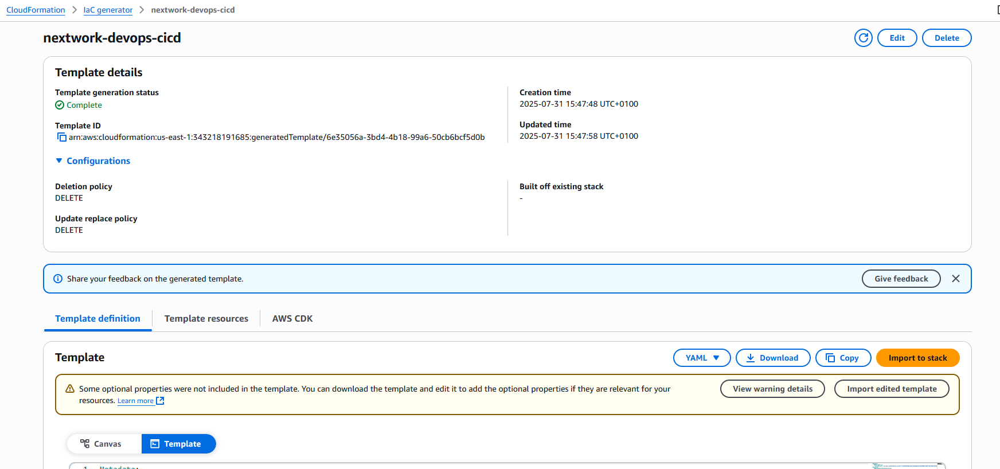

---

## 🧱 IaC Template

 

---

